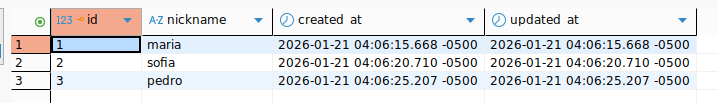
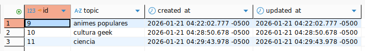
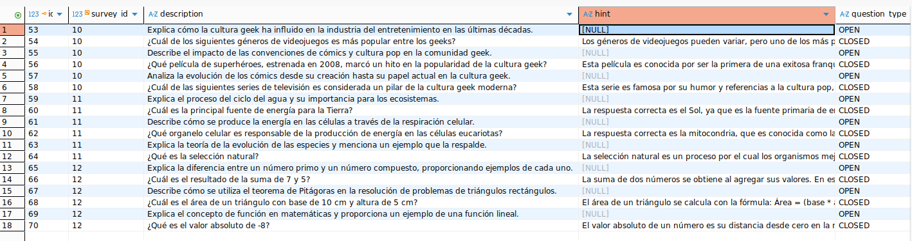
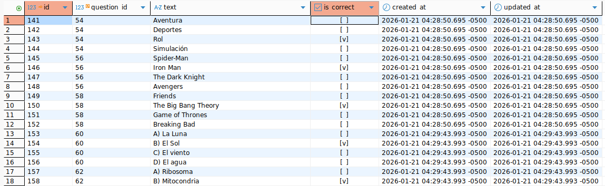
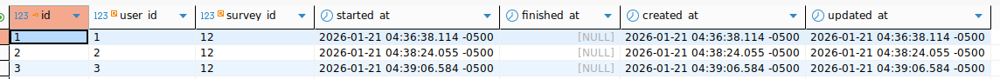
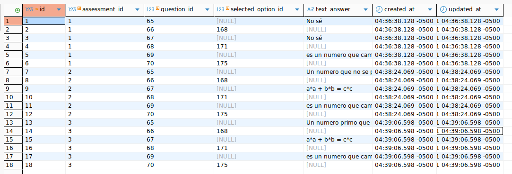
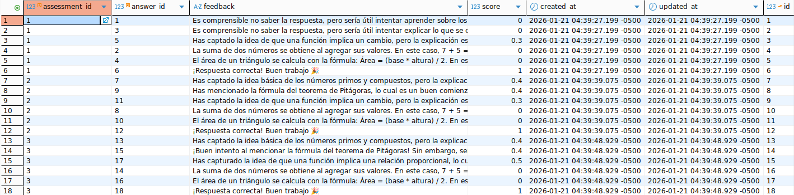
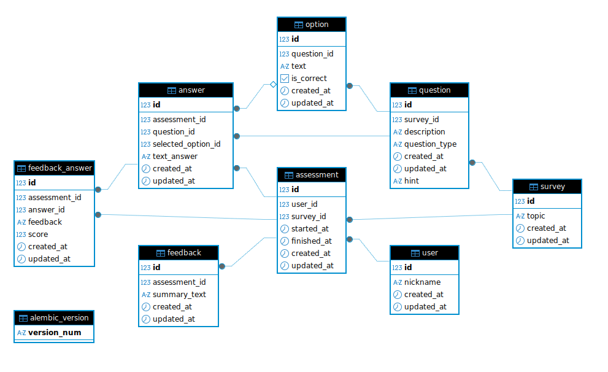

# 🧠 Interactive Trivia / Quiz Agent

## Overview

This project implements an **interactive trivia / quiz system powered by LLM agents**.

Users answer quizzes on a given topic, receive **educational feedback**, and are later **ranked** based on their performance.
The system focuses on **learning and feedback**, not just scoring.

Developed as part of **Ejercicio 2: Agente de Trivia / Quiz Interactivo**.

---

## 🎯 What the system does

* Generate trivia quizzes automatically from a topic
* Mix **open** and **multiple-choice** questions
* Evaluate answers objectively
* Provide constructive, encouraging feedback
* Rank participants and generate a summary report

---

## 🧠 Conceptual flow

```
Survey
 └── Questions (open / closed)
      └── Options (closed only)

User
 └── Assessment
      └── Answers
           └── FeedbackAnswer

Survey
 └── Metrics (ranking + summary)
```

---

## 🔐 Authentication (Mocked)

Authentication is intentionally simple:

```
X-User-Id: <user_id>
```

No passwords, no tokens.

---

## 📊 API Examples (with images)

---

## 👤 User

**Entity**: User
Represents a participant in the trivia system.

**Endpoint**

```
POST /user
```

**Payload**

```json
{
  "nickname": "pedro"
}
```

**Result**



---

## 🧠 Survey

**Entity**: Survey
Represents a trivia game for a specific topic.

**Endpoint**

```
POST /survey
```

**Payload**

```json
{
  "topic": "matematicas"
}
```

**Result**



---

## ❓ Question

**Entity**: Question
Represents a single trivia question (open or closed).

Questions are generated automatically when a survey is created.

**Result**



---

## 🔘 Option

**Entity**: Option
Represents a possible answer for a closed question.

Options are generated automatically together with closed questions.

**Result**



---

## 📝 Assessment

**Entity**: Assessment
Represents **one user answering one survey**.

**Endpoint**

```
POST /survey/{survey_id}/answers
```

**Headers**

```
X-User-Id: 3
```

**Payload**

```json
{
  "answers": [
    {
      "question_id": 65,
      "text_answer": "Un número primo no se puede expresar como multiplicación de otros"
    }
  ]
}
```

**Result**



---

## ✍️ Answer

**Entity**: Answer
Represents a single response to a question.

**Payload fragment**

```json
{
  "question_id": 66,
  "selected_option_id": 168
}
```

**Result**



---

## 💬 FeedbackAnswer

**Entity**: FeedbackAnswer
Stores educational feedback and an internal score for each answer.

**Endpoint**

```
POST /assesment/{assessment_id}/feedback
```

**Result**



---

## 🏆 Survey Metrics (Ranking)

**Entity**: Aggregated Results
Represents ranking and summary for a survey.

**Endpoint**

```
GET /survey/{survey_id}/metrics?ranking_size=3
```

**Result**

```json
{
  "ranking": [
    {
      "user": "pedro",
      "rank": 1,
      "avg_score": 0.383
    },
    {
      "user": "sofia",
      "rank": 2,
      "avg_score": 0.35
    },
    {
      "user": "maria",
      "rank": 3,
      "avg_score": 0.217
    }
  ],
  "summary": "Se obtuvo un ranking para la encuesta 'matematicas', con un total de 6 preguntas (3 abiertas y 3 cerradas). El mejor desempeño general fue de pedro."
}
```

## 🛠 Tech Stack

**Backend**

* FastAPI
* Pydantic v2
* SQLAlchemy 2.0
* Alembic
* PostgreSQL

**LLM**

* LangChain
* OpenAI

---

## Database Schema



This diagram shows the data model for an  **interactive quiz system** :

* **Survey** : Defines a quiz topic and groups questions.
* **Question** : Belongs to a survey; can be **OPEN** or **CLOSED** (closed questions may include a hint).
* **Option** : Possible answers for closed questions; exactly one is correct.
* **User** : A participant identified by a nickname.
* **Assessment** : Represents one user answering one survey (one attempt per user per survey).
* **Answer** : The user’s response to a question (text for open, selected option for closed).
* **FeedbackAnswer** : Per-answer educational feedback with an internal score (0–1).
* **Feedback** : Overall summary feedback for an assessment.

**Flow:**

User → Assessment → Answers → FeedbackAnswer, all tied back to the Survey and its Questions.

## 🚀 Run the project

```bash
docker compose up -d
```
